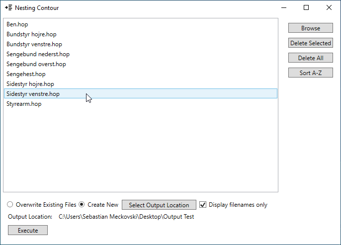
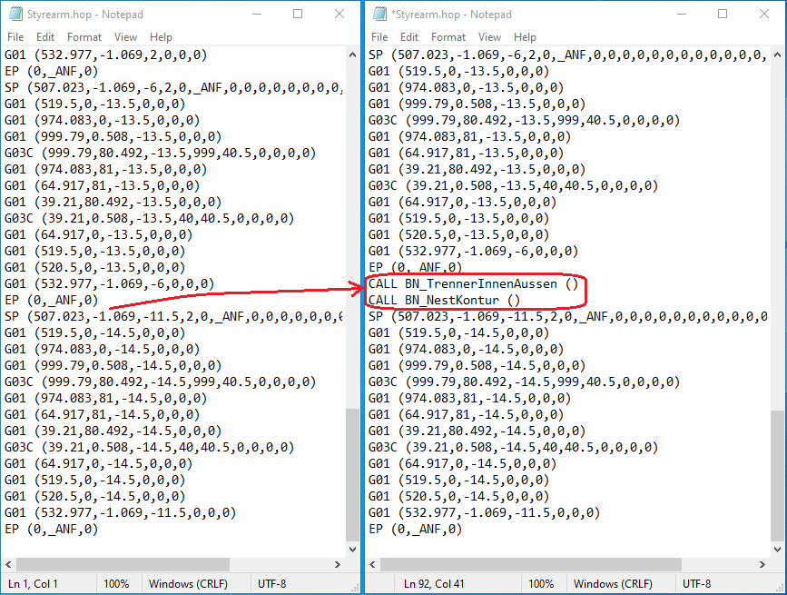

<H1>CNC File Modifier</H1>

The program was designed to make a few simple changes to the large quantities of .hop (or .txt) files. These files contain information that allows the CNC machine to operate correctly. It is used by custom design furniture Raaschou company in Copenhagen, Denmark. The machine engineer used to have to do these changes made manually, which was taking the Engineer on average one hour every week to accomplish. This application allows making changes to large quantities of these files in a matter of few clicks, which slightly reduces production costs.

The program has simple design and a number of user navigation buttons:
</img>

The program inserts few lines of commands in a specific place in the file. The modification is illustrated in the image below:
</img>
